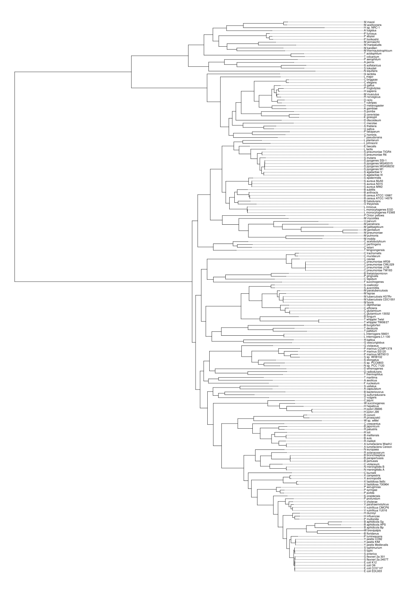
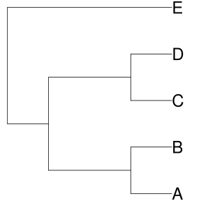

```{r setup, include=FALSE}
knitr::opts_chunk$set(echo = T, warning = F, message = F)

```

```{r load_libs}
library(ape)
library(dplyr)
library(ggplot2)
library(ggtree)
```

## 1: read the tree in newick format from url to tree1 object

```{r}
set.seed(42)
tree1 <- ape::read.tree('https://www.jasondavies.com/tree-of-life/life.txt')
str(tree1)
```

Since `tip.labels` are quite large, it can introduce some problems at the visualization step

To handle with this problem, I decide to rename `tip.labels`

```{r}
tree1$tip.label <- stringr::str_replace(tree1$tip.label, '[a-z]*_', '_')
str(tree1)
```

## 2. Draw the tree using ape functionality

```{r}
plot(tree1, no.margin=T, align.tip.label= T, cex=.6, font=1, use.edge.length = F)
```


## 3. Save this tree in raster format (png) and vector (svg or pdf)

```{r}
raster_tree <- function(tree, tree_name, height, width, cex=2) {
  png(tree_name, height = height, width = width)
  plot.phylo(tree, no.margin=T, align.tip.label= T, cex=cex, font=1)
  dev.off()
}

vector_tree <- function(tree, tree_name, height, width, cex=2) {
  svg(tree_name, height = height, width = width)
  plot.phylo(tree, no.margin=T, align.tip.label= T, cex=cex, font=1)
  dev.off()
}

dir.create('plots/tree1', recursive = T)
raster_tree(tree1, "plots/tree1/tree1.png", height=1873.597, width=1302.835, cex=.6)
vector_tree(tree1, "plots/tree1/tree1.svg", height=21, width=14, cex=.6)
```


```{r out.width = '100%'}

```

## 4. Draw this tree unrooted or circular using ape functionality

```{r}
plot(unroot(tree1), type="unrooted", no.margin=T, lab4ut="axial", edge.width=2)
```

## 5. Create a new tree2 object

```{r}
tree2 <- read.tree(text="(((A, B), (C, D)), E);")
```

## 6, 8. Draw the new tree using the standard function from the ape package and save	in raster and vector formats (lavels are visible)

```{r}
dir.create('plots/tree2', recursive = T)
raster_tree(tree2, "plots/tree2/tree2.png", 480, 480)
vector_tree(tree2, "plots/tree2/tree2.svg", 4, 4)
```

```{r out.width = '50%'}

```

## 7. Unrooted tree

```{r}
plot(unroot(tree2), type="unrooted", no.margin=T, lab4ut="axial", edge.width=2, cex=2)
```


## 9. Draw tree object using ggtree package

```{r}
ggtree(tree2)+
  geom_text2(aes(subset=!isTip, label=node), hjust=-.3)+
  geom_tiplab()+
  theme(aspect.ratio = 1, plot.title = element_text(hjust = 0.5))+
  ggtitle('tree2: rooted format')
```

```{r}
ggtree(tree2, layout = 'circular')+
  geom_text2(aes(subset=!isTip, label=node), hjust=-.3)+
  geom_tiplab()+
  theme(aspect.ratio = 1, plot.title = element_text(hjust = 0.5))+
  ggtitle('tree2: circular format')
```