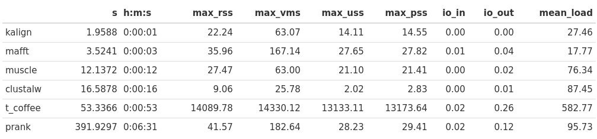
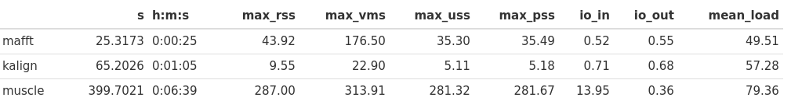

## Pipeline: structure

## Pipeline: information

Alignment tools (check versions in `env.yaml` file):
* clustalw2: [Clustal W and Clustal X version 2.0](https://academic.oup.com/bioinformatics/article/23/21/2947/371686)
* mafft: [MAFFT: a novel method for rapid multiple sequence alignment based on fast Fourier transform](https://www.ncbi.nlm.nih.gov/pmc/articles/PMC135756/)
* muscle: [MUSCLE: multiple sequence alignment with high accuracy and high throughput](https://www.ncbi.nlm.nih.gov/pmc/articles/PMC390337/)
* prank: [Phylogeny-aware alignment with PRANK](https://pubmed.ncbi.nlm.nih.gov/24170401/)
* t-coffee: [T-Coffee: Tree-based consistency objective function for alignment evaluation](https://pubmed.ncbi.nlm.nih.gov/24170398/)


## Pipeline: execution

```commandline
snakemake --cores 4 --use-conda --conda-prefix $(pwd)
```

## Answers

1. What sequences were used for analysis? Provide type of biopolymer, organism, gene name
    
    Based on the BLASTN results:

    * organisms: different yeasts (e.g., *Kluyveromyces lactis*, *Saccharomyces cerevisiae*, etc)
    
    * gene: *SUP35*
    
    * biopolymer: DNA

2. Benchmark table (more about notation), aligners sorted by time execution in seconds (`s` column).
Time execution dramatically increased for t_coffee and prank aligners, and also the t_coffee required
a lot of memory. 


    * clustalw: not optimal, because in case of some problem during the first alignment iteration this problem
    will be saved at the downstream analysis
    * t-coffee: more accurate than clustalw; the base conception similar to clustalw algorithm
    * mafft, muscle -- iterative aligners, more accurate than clustalw
    * kalign: very fast, the quality is accessible
    * prank: the slowest aligner; however, if I set some optional parameters related to given fasta file
    (e.g., ORF coordinates), I guess the results must be more precise than the other algorithms output

3. What is wrong with the alignment of SUP35_10seqs_strange_aln.fa and how to fix it?
    * wrong sequence ID: `>SUP35_Spar_A12_Liti_` instead of `>SUP35_Spar_A12_Liti`
    -> solution: rename seq id :)
    * wrong start: `SUP35_Spar_A12_Liti_` sequence doesn't start properly -> solution: use prank with
    ORF coordinates  input parameter
    * wrong sequence: `SUP35_Spar_A12_Liti_` contains sequences (e.g., TTTTAACAA)
     which are not present in input fasta -> solution: check that you use correct input file
    * Also, the nt sequence written in one line after fasta header is unusual format for aligners which
    we used
4. Obtain amino acid sequences for these data. Repeat p.2 on amino acid sequences.

    Nucleotide -> AA translation was performed by faTrans tool
    
    ```commandline
    faTrans data/SUP35_10seqs.fa data/aa/SUP35_10seqs.fa
    ```
    
    All out alignments (tools: mafft, kalign, muscle) are located in `out` folder

5. Optional Repeat p. 2 on the alignment of 250 DNA sequences (SUP35_250seqs.fa). Has our choice of algorithm changed?

    Clustalw, T-coffee and Prank worked too long. Also, the time of muscle alignment process has also
    significantly increased: it can be connected with algorithm complexity since the algorithm is sensitive for
    the size of the input data. Using Gblocks online tool, I see that muscle alignment contains
    the smallest percent of new number of positions (64%), and kalign contains the largest percentage (69%).
    

6. How to add to the alignment another sequence using mafft and muscle?

    * muscle:
    ```commandline
    muscle -profile -in1 SUP35_A.afa -in2 SUP35_B.afa -out SUP35_A_B.afas
    ```
    * mafft:
    ```commandline
    mafft --add SUP35_A.afa --reorder SUP35_B.afa > SUP35_A_B.afas
    ```

7. How to add two more sequences, pre-aligning them with the mafft or muscle?

    * muscle:
    ```commandline
   muscle -in SUP35_B.fa -out SUP35_B.afa
   muscle -profile -in1 SUP35_A.afa -in2 SUP35_B.afa -out SUP35_A_B.afas
    ```
   * mafft:
   ```commandline
   mafft --addprofile SUP35_B.afa SUP35_A.afa > SUP35_A_B.afas
   ```

8. Optional Try to run Gblocks (for alignment of 10 and 250 sequences).
What percent of alignment remains after starting Gblocks with strict and non-strict parameters
(specify parameters)?

```commandline
Parameters used
Minimum Number Of Sequences For A Conserved Position: 6
Minimum Number Of Sequences For A Flanking Position: 8
Maximum Number Of Contiguous Nonconserved Positions: 8
Minimum Length Of A Block: 10
Allowed Gap Positions: None
New number of positions in SUP35_10seqs.fa-gb, muscle output:  1753  (77% of the original 2275 positions)
```

```commandline
Parameters used
Minimum Number Of Sequences For A Conserved Position: 126
Minimum Number Of Sequences For A Flanking Position: 212
Maximum Number Of Contiguous Nonconserved Positions: 8
Minimum Length Of A Block: 10
Allowed Gap Positions: None
New number of positions in SUP35_250seqs.fa-gb, muscle output: 1501  (64% of the original 2313 positions)
```