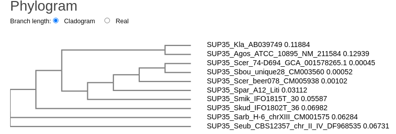
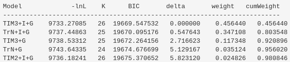
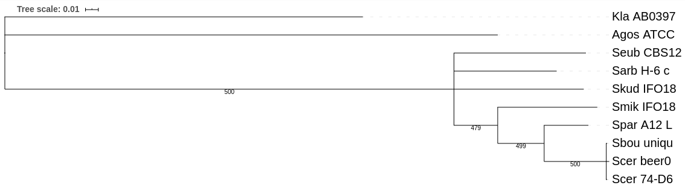

## A: answers

1. Build the NJ tree for this alignment, add it to the report. You may use any NJ implementation, there are some available online.

    * used tool: https://www.ebi.ac.uk/Tools/phylogeny/simple_phylogeny/
    
    * out tree: 
    
    

2. Does it support the choice of Agos + Kla as an external group?

    No, Sarb and Seub are more appropriate outgroups.
 
3. Model selection:
To select appropriate model for our data, we can use jmodeltest or ModelFinder. Which model works best for the data?

    For this task, I used `jModelTest2 on XSEDE` tool on CIPRES server (https://www.phylo.org/portal2/home.action).
    
    Best models: TIM3+I+G (BIC = 19669.547532), TrN+I+G (BIC = 9737.44863)
    
    

4. Info will appear soon..
    
## B: answers

1. Build an ML tree (500 bootstrap replicates) for the whole sequence using RAxML or IQ-Tree with GTRCAT model.
    
    Firstly, I renamed fasta ids in `data/SUP35_aln.best.fas` file for properly conversion of fasta
    format to phylip format.
    
    Secondly, I converted the formats using http://www.ebi.ac.uk/Tools/sfc/emboss_seqret/ server: 
    output file -- `data/SUP35_aln.best.phy`
    
    Finally, I analyze the data using http://www.atgc-montpellier.fr/phyml/ server.

2. Info will appear soon..

3. Root the tree obtained in 1, and “collapse” (cut-off) clades with bootstrap support < 70%.
Display the resulting tree with bootstrap support (you can choose any way to draw it).
Based on the tree, describe the relationship between the taxa S. cerevisiae, S. boulardii, and S. paradoxus.
    
    Tool: https://itol.embl.de/
    
    Tree after clades collapsing:
    
    
    
    *S. cerevisiae*, *S. boulardii*, and *S. paradoxus* are polyphyletic group
    (all descendants included, but not the common ancestor)
    
    Also, there is polytomy relationships between *Scer_beer*, *Scer_74* and *Sbou_uniqu*.    
    