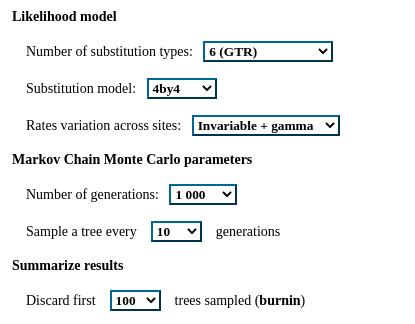
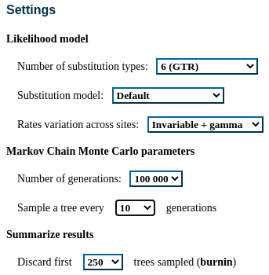
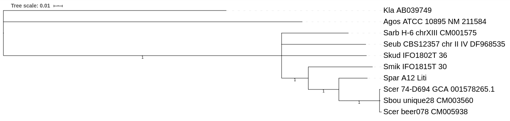

## A: answers

Used tool: http://www.phylogeny.fr/one_task.cgi?task_type=mrbayes
Given parameters:



The warning was:
```commandline
Warning: MrBayes returned the following warnings:
MrBayes suspects that your runs have not converged because the tree samples are very
different (average standard deviation of split frequencies larger than 0.10 (0.20)).
MrBayes suggests that you run the analysis longer or
try to improve the MCMC sampling eff2iciency by finetuning MCMC proposal or heating parameters.
```

Given parameters:



There were no warnings, and the tree was:

```commandline
      Clade credibility values:

      /--------------------------------------------------------------- Kla_AB0397 (1)
      |                                                                               
      |--------------------------------------------------------------- Agos_ATCC (2)
      |                                                                               
      |                                                    /---------- Scer_74-D6 (3)
      |                                                    |                          
      |                                         /----100---+---------- Sbou_uniqu (4)
      |                                         |          |                          
      +                               /---100---+          \---------- Scer_beer0 (5)
      |                               |         |                                     
      |                    /----100---+         \--------------------- Spar_A12_L (6)
      |                    |          |                                               
      |          /----55---+          \------------------------------- Smik_IFO18 (7)
      |          |         |                                                          
      |          |         \------------------------------------------ Skud_IFO18 (9)
      \----100---+                                                                    
                 |                                         /---------- Sarb_H-6_c (8)
                 \--------------------72-------------------+                          
                                                           \---------- Seub_CBS12 (10)
```

At what bootstrap / posterior probability values cutoff the topology of the tree match with the ML tree from the previous homework?

If the credibility (aposterior probability) >= 100, the bayesian topology consistent with the ML-builded tree.

At the plot below, branches with bootstrap < 1 (and, correspondingly, credibility < 100) were collapsed:



## B: answers

The best model was **TIM3+I+G**. However, 

```commandline
The TIM1, TIM2, TIM3, TPM1uf, TPM2uf, TPM3uf and TrN substitution models were replaced by the GTR model
```

(reference: [link](https://www.ncbi.nlm.nih.gov/pmc/articles/PMC3675023/))

Since MrBayes has already been implemented with GTR model (see above), I use ML approach (bootstrap = 500) for this task.

