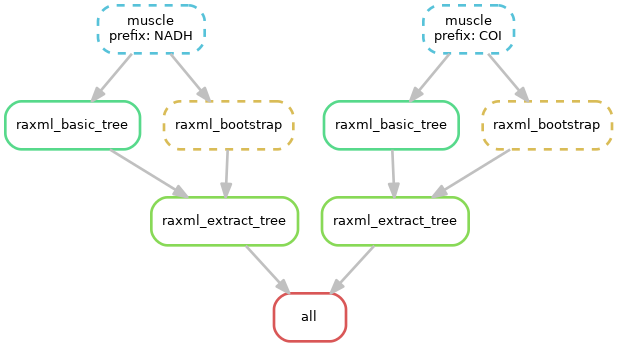

## Project

## Species

* KU985936.1 *Dicamptodon ensatus*
* KC870882.1 *Dicamptodon copei*
* MN135584.1 *Ambystoma maculatum*
* MG421393.1 *Ambystoma macrodactylum*
* KU986169.1 *Ambystoma cingulatum*
* KU986241.1 *Ambystoma opacum*
* KU986212.1 *Ambystoma tigrinum*
* KU986196.1 *Ambystoma californiense*
* KU986254.1 *Ambystoma annulatum*
* MN135418.1 *Ambystoma texanum*
* KU985600.1 *Ambystoma mabeei*

## Markers

* COI, subunit 1
* NADH, subunit 2

## Pipeline: execution

```commandline
snakemake --cores 4 --use-conda --conda-prefix $(pwd)
```

## Pipeline: structure



## Gblocks: alignment filtering

* Allow smaller final blocks
* Allow gap positions within the final blocks
* Allow less strict flanking positions

## Results

Presentation: [link](https://docs.google.com/presentation/d/1W2Ez__H9bYv6UkLem_np-S3FpyhYRjMwnRBMkQC_SiU/edit?usp=sharing)

## Conclusion

* NADH subunit 2 is more appropriate as marker than COI, subunit 1
* ML-based phylogenetic tree looks more accurate and interpretable than NJ-based phylogeny
* Filtered alignments (Gblocks, non-strict mode) give more precise and accurate phylogeny than unfiltered alignments
* Consistency between molecular and morphological phylogenies
* Future aims, suggestions — expand the number of species from the different locations, select more variable marker gene across the species
